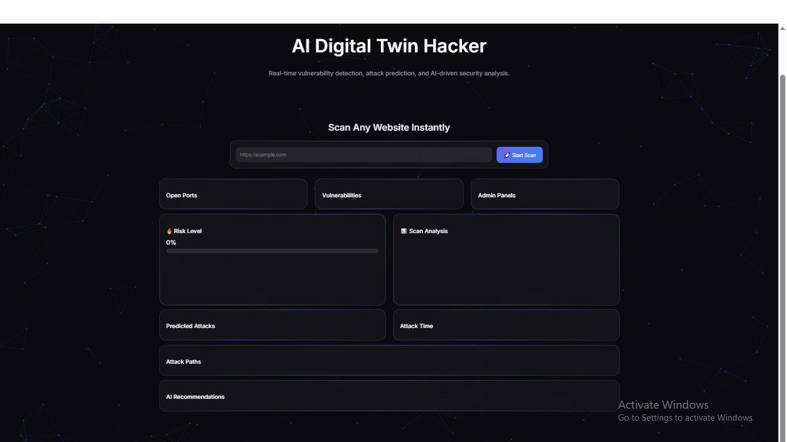
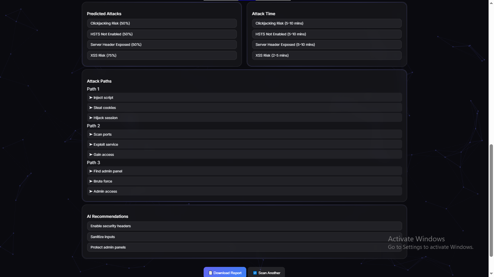
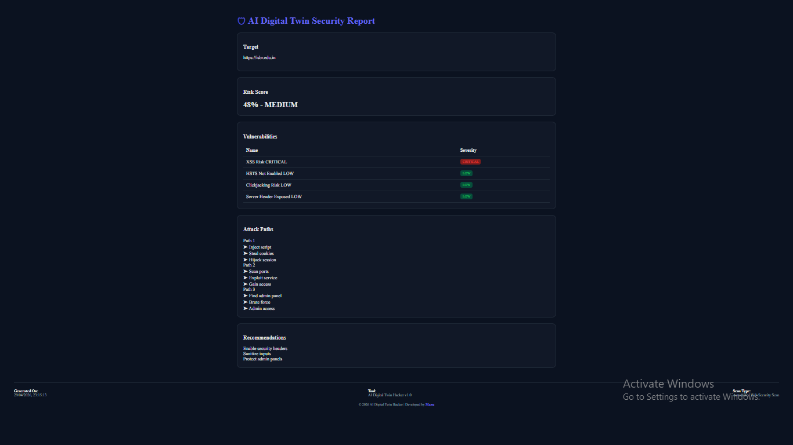

Here is a **fully professional, copy-paste ready `README.md`** tailored for your project. This is structured like real security tools (Nessus/Burp style) and will make your repo look **serious and portfolio-ready**.

---

## ✅ COPY THIS FULL FILE

```markdown
# 🛡️ AI Digital Twin Hacker

> AI-powered web security scanner with real-time vulnerability detection, attack prediction, CVSS-based risk scoring, and attack path simulation.

---

## 🚀 Overview

**AI Digital Twin Hacker** is an advanced web security analysis platform that simulates real-world attack scenarios using AI-driven logic.

It scans a target website, detects vulnerabilities, predicts possible attack vectors, estimates exploit time, and generates a professional security report.

---

## 🔥 Features

- 🔍 **Vulnerability Detection**
  - XSS (Cross-Site Scripting)
  - Clickjacking
  - Missing Security Headers
  - Server Header Exposure

- 🌐 **Port Scanning**
  - FTP (21), SSH (22), HTTP (80), HTTPS (443)
  - MySQL (3306), POP3 (110), IMAP (143)

- 🔐 **Admin Panel Finder**
  - Detects exposed admin endpoints

- 🤖 **AI Attack Prediction**
  - Predicts attack types based on detected vulnerabilities

- 🧠 **Attack Path Simulation**
  - Step-by-step simulated attack chains

- ⏱ **Exploit Time Estimation**
  - Real-time attack duration estimation

- 📊 **CVSS-based Risk Scoring**
  - Severity classification: LOW / MEDIUM / HIGH / CRITICAL

- 📄 **Professional Security Report**
  - Downloadable HTML report (Nessus-style layout)

---

## 🧠 System Architecture

```

Target URL
↓
Scanner Engine (Ports + Vulnerabilities + Admin Panels)
↓
AI Engine (Prediction + Recommendations)
↓
CVSS Risk Calculator
↓
Attack Simulation Engine
↓
Frontend Dashboard + Report Generator

````

---

## 📸 Screenshots

> Add your screenshots in `static/images/`

### 🔹 Dashboard


### 🔹 Scan Results


### 🔹 Security Report


---

## ⚙️ Tech Stack

| Layer        | Technology |
|-------------|-----------|
| Backend     | Flask (Python) |
| Frontend    | HTML, CSS, JavaScript |
| Visualization | Chart.js |
| UI Effects  | Particles.js |
| AI Logic    | Custom-built algorithms |
| Scanning    | Python-based modules |

---

## ▶️ Run Locally

```bash
git clone https://github.com/manu-2006/AI-Digital-Twin-Hacker.git
cd AI-Digital-Twin-Hacker

pip install -r requirements.txt
python app.py
````

Open in browser:

```
http://127.0.0.1:5000
```

---

## 📊 Example Output

* Risk Score: **CRITICAL (CVSS-based)**
* Vulnerabilities Detected: 4
* Open Ports: 7
* Attack Paths Generated: 3
* Exploit Time: 2–10 minutes (estimated)

---

## 🎯 Key Highlights

* Real-time scanning with live UI updates
* AI-based attack prediction system
* CVSS-inspired risk scoring engine
* Futuristic dashboard UI
* Professional report generation

---

## 📌 Future Enhancements

* 🔗 CVE database integration (real vulnerabilities)
* 📥 Nessus / OpenVAS report import
* 🌍 Multi-target scanning
* 📄 PDF report export
* 🧠 ML-based vulnerability classification

---

## 👨‍💻 Developer

**Manu**
BCA Final Year Project

---

## 📄 License

This project is licensed under the MIT License

## ⭐ Support

If you found this project useful, consider giving it a ⭐ on GitHub!


